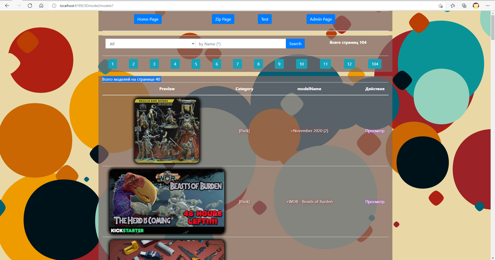
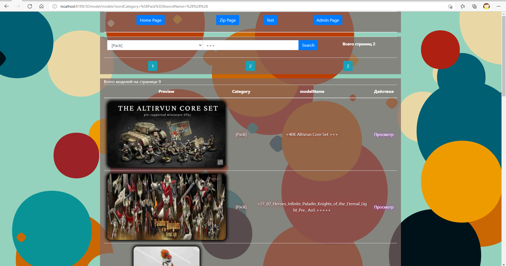
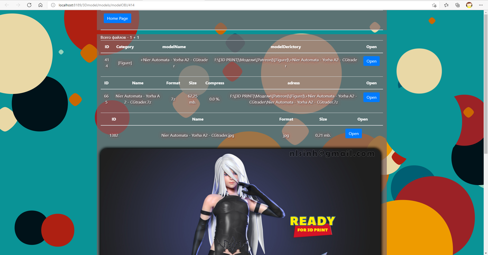
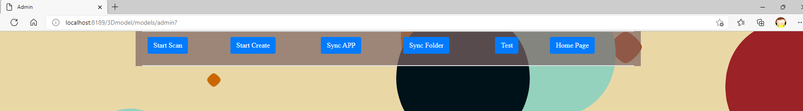

# 3DmodelsView
Application-Gallery of models for 3D printing

ENG

Application for easy viewing and search of 3D models for printing from a local disk. The algorithm scans the hard drive at a given address and converts folders into three entities. Object of the main class 3D model contains a collection of objects of the class "other" (images) and objects that are archives. Compression ratio is calculated for archives. Finished objects are saved to the database. Objects contain information about the local location and additional information for searching the database.

Spring Data JPA is used to access the database. Preview images of models in real time read from disk undergo ImageIO compression and Base64 encoding in multithreading. The Criteria Builder is used to compose search queries. The search query is returned back to the page.

Primary creation and scanning takes place through parallel Stream. Synchronization of changes in single-threaded. The local collection weighs 1.6 TB. Primary creation takes around 12 seconds.

A basic version of local folder synchronization for backup is also implemented.

RU

Приложение для удобного просмотра и поиска 3D-моделей для печати с локального диска. Алгоритм сканирует жесткий диск по заданному адресу и преобразует папки в три сущности. Объект основного класса 3D-модель содержит коллекцию объектов класса "другие" (изображения) и объекты, являющиеся архивами. Для архивов рассчитывается степень сжатия. Готовые объекты сохраняются в базе данных. Объекты содержат информацию о локальном местоположении и дополнительную информацию для поиска в базе данных.

Для доступа к базе данных используется Spring Data JPA. Предварительные изображения моделей в реальном времени, считываемые с диска, подвергаются ImageIO-сжатию и Base64-кодированию в многопоточном режиме. Criteria Builder используется для составления поисковых запросов. Поисковый запрос возвращается обратно на страницу.

Первичное создание и сканирование происходит через параллельный Stream. Синхронизация изменений однопоточная. Локальная коллекция весит 1,6 ТБ. Первичное создание занимает около 12 секунд.

Также реализована базовая версия синхронизации локальных папок для резервного копирования.

